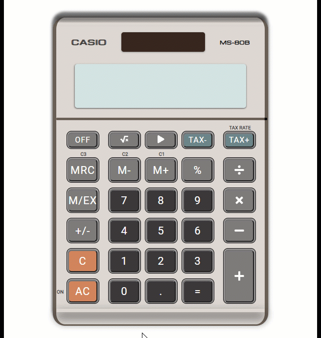

# Casio MS-80B Calculator

## Description
<ul>
    <li>The design of the calculator is based off of the Casio MS-80B and the look is made using HTML/CSS.
    <li>I implemented the basic calculator functions that the typical person would use (addition, subtraction, multiplication, division, square roots, and negatives). Other functions like M- and M+ were omitted - pressing the buttons will do nothing.
</ul>

## GIF


## Technologies
Project is created with React

## Usage

```
$ npm start
```